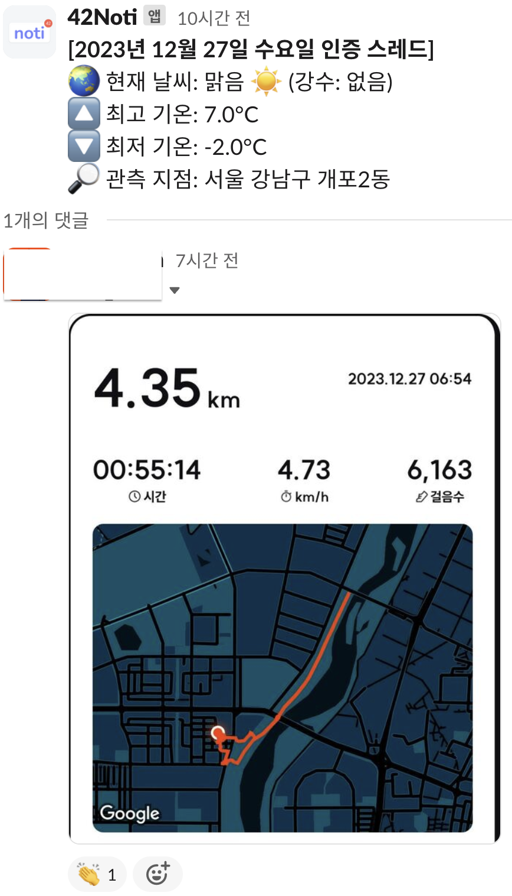

# 📂 프로젝트 소개

공공데이터포털에서 제공하는 기상청 API 를 이용하여 오늘의 날씨 정보를 매일 정해진 시간에 Slack 채널로 전송하는 Slack bot 입니다.



# 🛠 기술 스택

- Python
- Github Actions

# 🚀 시작하기

## ⚙️ 사전 준비

- [[공공데이터포털]](https://www.data.go.kr/) 에서 개인 API 인증키를 발급 받아야 합니다. 발급 후 사용 승인까지 최소 1일 정도 소요됩니다.
- [[Slack API]](https://api.slack.com/apps) 에서 App 을 생성하고 OAuth Token 을 발급 받습니다.

## 📚 라이브러리 설치

가상환경 설치 후 라이브러리 설치를 권장합니다.

1. 프로젝트 최상단에 가상환경을 생성합니다.
   ```bash
	$ python -m venv venv
   ```

2. 가상환경을 실행합니다.
   ```bash
    # MacOS
	$ source venv/bin/activate

	# Windows
	$ venv/Scripts/actiavte.bat
   ```

3. 라이브러리를 설치합니다.
   ```bash
	$ pip install -r requirements.txt
   ```

## 🏠 로컬 환경 구성

1. `.env` 파일 생성
   - 프로젝트 폴더 최상단에 `.env` 파일을 생성합니다.
   - [Slack API App 페이지] - [OAuth & Permissions] - [OAuth Tokens for Your Workspace] 로 이동하여 Bot User OAuth Token 항목에서 발급 받은 토큰을 `SLACK_TOKEN` 에 입력합니다.
   - Slack 워크스페이스의 전송하고자 하는 채널의 채널 ID 를 `SLACK_CHANNEL` 에 입력합니다.
   - 공공데이터포털에서 발급 받은 개인 API 인증키를 `SERVICE_KEY` 에 입력합니다.
   - 최종적으로 아래와 같은 형태로 작성합니다. (`.env.sample` 파일 참고)

	```
	SLACK_TOKEN="[Bot User OAuth Token]"
	SLACK_CHANNEL="[Slack Channel ID]"
	SERVICE_KEY="[공공데이터포털 개인 API 인증키]"
	```

2. 스크립트 실행
	- 로컬 환경에서 테스트 목적으로 Slack 채널에 메세지를 보내고 싶은 경우 `main.py` 를 실행합니다.
	```bash
	python main.py
	```

## 📦 배포하기

1. Github Actions Secrets 등록
   - Github Repository 의 Github Actions Secrets 을 등록합니다.
   - 등록하는 항목들은 `.env` 파일에 입력한 항목들과 동일합니다.

2. `.github/weather.yaml` 파일의 cron 항목에 적힌 시간을 기준으로 매일 작동합니다.
   - 참고로 Github Acionts 는 UTC 를 기준으로 작동하기 때문에 작동시키고자 하는 시간대 계산을 하셔야 합니다.

# 📱 기능

- 한국 시간(KST) 기준 오전 5시에 메세지를 전송합니다.
- Github Actions 의 Cron 을 이용해서 메세지 전송 일정을 조절할 수 있습니다.
- 기상청에서 당일 새벽 2시에 발표한 기상 예보 정보를 바탕으로 당일 최고 기온(오후 3시), 최저 기온(오전 6시) 정보를 가져옵니다.
- 현재 날씨와 강수는 새벽 5시를 기준으로 가져옵니다.
- 아래와 같은 형식으로 메세지를 전송합니다.

	```
	[2023년 12월 27일 수요일 인증 스레드]
	🌏 현재 날씨: 맑음 ☀️ (강수: 없음)
	🔼 최고 기온: 7.0°C
	🔽 최저 기온: -2.0°C
	🔎 관측 지점: 서울 강남구 개포2동
	```

# 💡 기여 방법

프로젝트에 기여하는 방법에 대한 가이드를 제공합니다.

1. Fork 프로젝트
2. 새로운 브랜치 생성: `git checkout -b feature/new-feature`
3. 변경 사항 커밋: `git commit -m 'Add new feature'`
4. Fork에서 원본 저장소로 Pull Request 생성

# 💼 라이선스

이 프로젝트는 MIT 라이선스 하에 배포됩니다. 자세한 내용은 라이선스 파일을 참조하세요.